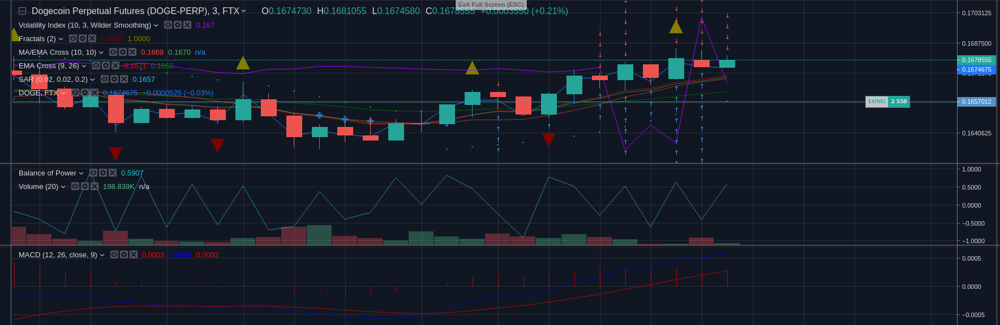

# SemiAutoTrader (Aka "Blackmirror")
<pre>
                                                                                           
  ██████╗ ██╗      █████╗  ██████╗██╗  ██╗███╗   ███╗██╗██████╗ ██████╗  ██████╗ ██████╗   
  ██╔══██╗██║     ██╔══██╗██╔════╝██║ ██╔╝████╗ ████║██║██╔══██╗██╔══██╗██╔═══██╗██╔══██╗  
  ██████╔╝██║     ███████║██║     █████╔╝ ██╔████╔██║██║██████╔╝██████╔╝██║   ██║██████╔╝  
  ██╔══██╗██║     ██╔══██║██║     ██╔═██╗ ██║╚██╔╝██║██║██╔══██╗██╔══██╗██║   ██║██╔══██╗  
  ██████╔╝███████╗██║  ██║╚██████╗██║  ██╗██║ ╚═╝ ██║██║██║  ██║██║  ██║╚██████╔╝██║  ██║  
  ╚═════╝ ╚══════╝╚═╝  ╚═╝ ╚═════╝╚═╝  ╚═╝╚═╝     ╚═╝╚═╝╚═╝  ╚═╝╚═╝  ╚═╝ ╚═════╝ ╚═╝  ╚═╝  
                   FTX Trade Mirroring Platform ~ Darkerego, 2020-2022 ~ version 0.1.1       
                          FTX Referral: https://ftx.com/profile#a=blackmirror

</pre>


# About Blackmirror

### Trade Signals via MqTT Now Available For Evaluation

<p>
I am currently streaming trade signals for use with this bot. They are available over mqtt at:
    beta.blackmirror.app:1883

Keep in mind that these signals are pretty alpha right now, but I am actually having some success. 
There are a couple of different streams you can use:

- /signals - the main stream. These are sent out when they are generated and only broadcast when they 
   open and close.
- /stream - these are updated in real time and just keep streaming in. 

Here is a sample command you can use to trade with these signals:

```
./app.py -m -a  -src binance --trade -tp .6  -sl 0.3 -cm market  \
-mc .75 -pc .25 -uri beta.blackmirror.app:1883 -mq -ot limit  -ms 29  -mt /stream -lS
```

Breakdown of command:

- enable monitor mode
- enable auto trader
- signal data source is binance
- actually trade
- take profit at .6%
- stop loss at .5%
- close with market (trailing stop) order
- use 75% of collateral max
- close 25% of the position at a time
- connect to the host
- enable mqtt
- try to use limit orders
- min score to enter trade 29% (its a weighted average of indicators)
- use the live stream
- gotta enable -lS to use the live stream

</p>
## What's new - 07/30/2022
- Option to use sar as stop loss. Specify period to use: example: use the one minute as a stop: `-ssl 60` WARNING: be 
logical about this. If you enter a long position and the 1 minute sar is saying sell, then don't be surprised when 
the system immediately closes your position. 
- Fixed a rather dreadful error that was causing duplicates of the trade engine and receiver threads. The system now 
runs 100x smoother... 
- Began adding support for using Fibonacci retracement levels to calculate take profit and stop loss levels. Not fully 
implemented just yet. The idea is the user will specify a time period to calculate the standard deviation on and then 
run a fib retrace on this stdev so that take profit orders will be set around the next level, and (optionally) stop loss 
can be set at the previous level. 
- Began adding an advanced position logging system. Eventually I will have every position graphed out when the position 
is closed, showing entrance and exit points along with optional other data. Also every position is stored in an sql db - 
this is currently implemented. 

# TODO
- fix and port web interface back in code
- finish fib retrace
- finish position graphing
- finish anti-liquidation logic

### What's New - 04/14/2022
- Bot is stable!
- Fixed random api freezes
- Switched trailing stop to use API
- Order chasing works
- Signal engine honors exit signals
- Countless bugfixes

Feel free to message me on telegram @chev603 you have any questions, comments or concerns. Have fun.

<p>
<b>The Case for Blackmirror's Existence</b>


This a tool for semi-automated trading on [FTX](https://ftx.com/profile#a=blackmirror). I created it because I was tired 
of loosing money because I was getting distracted and having to leave the computer without having set a top loss, and 
tired of missing opportunities to take profit for the same reason. Initially, the idea was to create a fully automated 
trade platform, however at some point I decided to begin focusing on making the system more targeted towards 
"Semi-Automating the Manual Trade Process" -- Which is why the repo is called "SemiAuto Trader", despite the fact that 
the bot is actually called "Blackmirror". However, as time went on (and I have been developing this thing 
for *years* ...), the project took yet another direction, and now I am working on making this a fully automated system 
again ... 
</p>

<p>
<b>The Case for Open Sourcing This Project </b>

I open sourced this project for three reasons ... First, I think this is some of my better work, and figured it 
would look good on my resume (I am available for hire - xelectron at protonmail dot com). Next, and more importantly - 
I had hoped that by giving this software away, people that found it useful may support my work by using my 
[FTX Referral](https://ftx.com/profile#a=blackmirror) link. So far, that hasn't happened, but you never know. Finally, 
the *most* important reason that I open sourced this project is because this is only half of the project: 
In development for several years now is a very powerful trade signal engine. It is now nearly completed and in the 
beta testing phase. In the very near future, I will be selling subscriptions to my trade signals which can be consumed 
by this bot via mqtt. So, in the meantime -- stay tuned, and enjoy. Remember, if you found this work useful, please 
consider supporting me by using my [FTX Referral](https://ftx.com/profile#a=blackmirror) code!

</p>

# Documentation

### Demo of Bot Taking Profit
[](https://asciinema.org/a/464756)https://asciinema.org/a/464734

### AutoTrader Features:

Autotrader is the "backbone" of the program. This is my signature feature, and the one I am most proud of 
and find the most useful. Personally I think it is one the coolest things I have written. It assumes multiple functions, 
from guilded semi-automatic  trading (doing thing like taking profit and setting stops). 
It also has the ability to reopen a position after taking profit. This can be done either incrementally, or all at once. 
Most of these options are the same as in the last release, with the notable exception is `--close_method`. 
This is a lot like `-reopen`. Essentially you can choose to take profit in increments, potentially maximizing your gains.
It is the same idea as "pyramiding" your orders. But now, it happens automatically. 


- Automatic take profit
  - take profit via trailingstop
  - market order
  - limit order
  - incrementally take profit via a series of pyramid limit orders
  - Automatic stop loss
    - If you forget to set one, the program will handle it for you
- Automatically reopen your position
   - via limit, market, or incrementally (see incremental orders section below)

These features allow you to set a position and walk away from your screen, perhaps even 
go to sleep in peace! 

### API Functionality Features:
- Buy and sell
- Cancel orders
- View portfolio
- Get deposit addresses
- "Order chase" - keep your limit order on top of the order book
- Get open orders
- Set account leverage

#### Incremental Orders
- The process is:
  - Bot calculates the standard deviation over the last user supplied period (default 5 minutes)
  - Then the bot sets take profit limit sell orders up the book in this range (for a long)
  - Next, the bot sets limit buy orders orders to reopen your position going down the book in this range (for a long)
  - vice versa for a short
- Example: 
  - $1000 long BTC-PERP entered at 39000 hits target profit of .1% at $40000 - , so your position is now worth $1100
  - Standard deviation for the last 5 minutes is $50 - so it is likely that BTC will move that much again over the next 5 minutes
  - So, we set take profit orders like this:
    - Sell $60.31 at 40012.5
    - Sell $120.63 at 40025.0
    - Sell $250.25 at 40037.5
    - Sell $500.5 at 40050.0
  - This way, your average take profit price increases. This allows your sort of "trade the natural volatility"
  - The same thing happens in reverse when we reopen our position:
    - Buy $60.31 at $39987.5
    - Buy $120.63 at $39975.0
    - Buy $250.25 at $39962.5
    - Buy $500 at $39950.0
<p> This way, your average entry price of your now re-opened long position averages down as the market drops. 
However, you also have the option to sell a percentage of your position when you take profit. I think this is better, because then your stop loss moves up as the market rises (I like to take 25% profit when I hit my target which is usually 0.25%) I prefer to do this because if you set your take profit to say .5% and your stop loss to .25% , then as you buy and sell, your stop will end up moving with your position - because the bot will be calculating this including whatever gains you have made. Sort of like how you cannot really loose if you set your stop loss right before your entry after a successful trade. </p>



<p> Example of running autotrader with incremental take profit and reopen enabled. Each downward pointing arrow is the bot partially taking profit on a long, and each upward pointing arrow is the bot partially reopening the position. </p>


### Websocket and Mqtt Receivers (W.I.P.)
<p>Bot also supports consumption of trade signals over both mqtt and websockets. The format for 
signal consumption is: </p>


<b>Enter Signal:</b>
<pre>
{
  "Signal": "LONG",
  "Status": "open",
  "Instrument": "DOGEUSDT",
  "Score": 23.52941176470588,
  "Open_time": "2022-04-06 22:25:24.961880",
  "Entry": 0.141145,
  "Exit": 0,
  "Closed_at": 0,
  "PNL": "0.0%",
  "Highest_PNL": 0
}
</pre>

<b>Exit Signal:</b>
<pre>
{
  "Signal": "LONG",
  "Status": "closed",
  "Instrument": "ZILUSDT",
  "Score": 29.411764705882355,
  "Open_time": "2022-04-07 00:30:40.378296",
  "Entry": 0.12389,
  "Exit": 0,
  "Closed_at": 0,
  "PNL": "-0.012107514730810497%",
  "Highest_PNL": "0.09282427960287673%",
  "Live_score": "23.52941176470588"
}


</pre>

TODO: update this section and finish the receivers.


### Experimental Built in Strategy
<p><b> WARNING -- </b>

**The oscillation arbitrage engine and experimental sar strategy are broken right now, do not use them. 
You WILL lose money if you do.**</b>
</p>
<p>
With that said ... 

Introducing a new feature - a technical analysis framework, built to be modular such that we can author our 
own indicators and have a plug and play system to use with the trade engine. Currently, I have only written one 
indicator, which is multi timeframe slightly modified version of the parabolic sar indicator, which is included 
in this codebase. The idea is to start the program with no current open positions. The TA engine will enter trades 
when opportune, and the trade engine will take over from there. So, if you are going to use the experimental 
sar algo, then you may want to run it with `-ds` and without `--reopen`, because we do not want to reopen the 
position unless we are getting a valid trade signal. Rather we want positions to be opened by the TA engine, 
and then we want the trade engine to take profit when the `-tp` specified level is achieved. A trailing stop 
is good to use in this situation. It is enabled by default, so you don't need to worry about that. Do keep in 
mind that this is ALPHA software and your mileage may vary.

Example command to start up the SAR algo:
<pre>
$ ./main.py -a -tp 1 -ts .25 -sl .5 -sy ETH-PERP -sym ETHUSDT -xs .1
</pre>

<p>
Breakdown of command:

Start autotrader. Set take profit to 1%. Set trailing stop offset to .25% , set stop loss to .5% , trade on 
ftx with ETH-PERP futures, but monitor the binance ETHUSDT market to generate those signals. When entering a 
trade, enter with a size of .1 etherum. 
</p>

### Usage

<pre>
usage: SUPPORT MY WORK! USE MY REFERRAL: https://ftx.com/referrals#a=darkerego

optional arguments:
  -h, --help            show this help message and exit

General Opts:
  General Options

  -m, --monitor         Start the account monitor. See current status.
  -sa SUBACCOUNT, --subaccount SUBACCOUNT
                        Subaccount to connectto. None for main account.
  -v, --verbose         Verbose mode.
  -st, --show_tickers   Do not show tickers.

OscillationArbitrage Engine Options:
  -O, --osc_arb         Run experimental balance arbitrage engine.
  -ls LONG_SYMBOLS [LONG_SYMBOLS ...], --long_symbols LONG_SYMBOLS [LONG_SYMBOLS ...]
                        List of instruments to long.
  -ss SHORT_SYMBOLS [SHORT_SYMBOLS ...], --short_symbols SHORT_SYMBOLS [SHORT_SYMBOLS ...]
                        List of symbols to short
  -mp MIN_SPREAD, --min_spread MIN_SPREAD
                        Minimum arbitrage spread to target.
  -cc CHASE_CLOSE, --chase_close CHASE_CLOSE
                        Use order chase for position close
  -cr CHASE_REOPEN, --chase_reopen CHASE_REOPEN
                        Use order chase for position reopen

API Commands:
  Options for interacting with the exchange. For creating orders, the syntax is -b/-s <order type> <quantity> <price>

  -p, --portfolio       Get current balances
  -oc LIMIT_ORDER_CHASE LIMIT_ORDER_CHASE, --chase LIMIT_ORDER_CHASE LIMIT_ORDER_CHASE
                        Limit Order Chasing. Keeps your limit order at the top of the books.Specify order ID following integer representing the max number of order modifications before giving up and executing as market.
  -b BUY [BUY ...], --buy BUY [BUY ...]
                        Execute a buy order: --buy <limit> ETH-PERP <0.5> 2898.89
  -s SELL [SELL ...], --sell SELL [SELL ...]
                        Execute a sell order --sell <market> BTC-USD <0.1>
  -lc LIMIT_CHASE, --limit_chase LIMIT_CHASE
                        Chase this limit order this many times before .
  -cf, --chase_failsafe
                        Revert to market if order chase fails.
  -o, --orders          Return list of open orders.
  -c CANCEL, --cancel CANCEL
                        Cancel this order id.
  -L {1,2,3,5,10,20,50,100,101}, --leverage {1,2,3,5,10,20,50,100,101}
                        Set account leverage via API.

EXPERIMENTAL Trade Strategy Options:
  -S, --strategy        Use the TA based trade strategy engine.
  -str {sar}, --strat {sar}
                        Trade Strategy to use
  -sy SYMBOL, --symbol SYMBOL
                        FTX instrument to trade.
  -sym SYMBOL_MONITOR, --symbol_monitor SYMBOL_MONITOR
                        Binance symbol to watch.
  -xs CONTRACT_SIZE, --contract_size CONTRACT_SIZE

Websocket Trade Signal Options:
  -ws, --ws_signals     Enable websocket client for signals
  -mq, --mqtt_signals   Enable mqtt receiver for automatic trading of signals.
  -uri WS_URI, --ws_uri WS_URI
                        Websocket uri, wss://host:port
  -re, --reenter        Re enter position before it closes if price hits entry again.
  -src {binance}, --data_source {binance}
                        Exchange where the signals were aggravated.
  -exc [EXCLUDE_MARKETS [EXCLUDE_MARKETS ...]], --exclude_markets [EXCLUDE_MARKETS [EXCLUDE_MARKETS ...]]
                        Do not trade these markets

Auto Stop Loss Options:
  -a, --auto            Use AutoTrader
  -mo, --monitor_only   Do not trade. Monitor only.
  --trade, --really     This is a FAILSAFE options to prevent accidental losses! Will not-trade automatically without enabling.
  -ds, --disable_sl     Do not use stop losses.
  -sl STOP_LOSS_PCT, --stop_loss STOP_LOSS_PCT
                        Stop Loss Percentage represented as a floating point. -0.1 would be -10 percent PNL
  -tp TAKE_PROFIT_PCT, --take_profit TAKE_PROFIT_PCT
                        Percentage to take profit at, represented sa floating point number.0.2 wouild be 20 pcercent
  -tpo, --trailing_stop_off
                        Do not use Trailing Stops. Not sure why you would not to, but the option is here!
  -ts TS_OFFSET, --trailing_stop_offset TS_OFFSET
                        Trailing stop offset, represented as a floating point number, percentage of pnl.
  -ot {limit,market}, --order_type {limit,market}
                        Take profit order type.
  -ro {increment,market,None}, --reopen {increment,market,None}
                        Method to use to reopen positions. Market just sends a limit or market order. Increment splits size into several smaller orders according to standard deviation
  -cm {increment,market,limit,False}, --close_method {increment,market,limit,False}
                        Method to use to close positions. Market just sends a limit or market order. Increment splits size into several smaller orders according to standard deviation
  -ip {15,60,300,900,3600,14400,86400}, --increment_period {15,60,300,900,3600,14400,86400}
                        Standard deviation of this period (in seconds) to spread limit orders over when rebuilding position using increment mode. See documentation.
  -no NUM_OPEN_ORDERS, --num_orders NUM_OPEN_ORDERS
                        Number of open orders to reopen position in increments
  -ps POSITION_STEP_SIZE, --position_step_size POSITION_STEP_SIZE
                        Percentage to spread limit orders apart represented as floating point numberDefault: 0.2.
  -rl RELIST_ITERATIONS, --relist RELIST_ITERATIONS
                        Number of iterations before canceling and relisting open take profit and reopen orders.
  -hm, --hedge_mode     Hedged trading mode.
  -hr HEDGE_RATIO, --hedge_ratio HEDGE_RATIO
                        Hedge ratio. Greater than 0: Delta is long. Less than 0 (negative): Delta is short.
  -mc MAX_COLLATERAL, --max_collateral MAX_COLLATERAL
                        Max amount of collateral to use. 1 == 100 percent, .5 == 50 percent.
  -pc POSITION_CLOSE_PCT, --position_close_pct POSITION_CLOSE_PCT
                        Float point percentage (.5 is 50 percent) of position to close at a time when taking profit.

</pre>